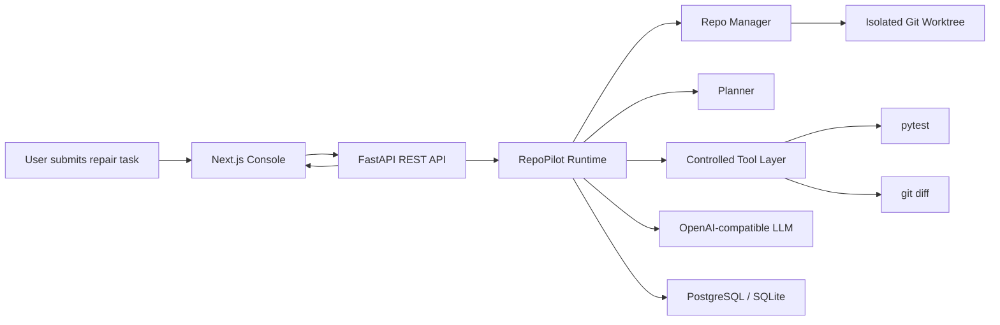

# Architecture

## System Flow

## Runtime Pipeline

RepoPilot uses an inspectable repair pipeline instead of a single black-box prompt:

1. **Create Run**: persist the task input and create a new run record.
2. **Create Worktree**: create an isolated Git worktree from the requested base ref.
3. **Profile Repo**: collect repo shape, language hints, test framework signals, and top-level directories.
4. **Plan**: ask the planner for task type, suspected files, test strategy, and a short reasoning summary.
5. **Observe**: run tests and summarize the initial failure.
6. **Act / Repair**: read selected files, generate a patch plan, apply minimal snippet replacements, and record each step.
7. **Verify**: run tests again, collect final status, diff text, diff stats, and changed files.
8. **Finish**: persist the full trace, command events, summary, and failure classification.

## Command Risk Model

Commands are classified before execution:

- `safe_read`: read-only commands such as `git` and `rg`.
- `safe_exec`: bounded execution commands such as `python -m pytest -q`.
- `high_risk`: dependency or environment commands such as `pip` and `npm`; these pause the run until approval.
- `blocked`: unsupported commands are rejected.

This keeps the Agent useful while preserving clear execution boundaries.

## Persistence Model

- `agent_runs`: one row per repair task, including repo path, task input, status, worktree path, summary, and result JSON.
- `run_steps`: structured trace entries for plan, observe, repair, and finish phases.
- `command_events`: command, risk level, approval status, exit code, output summaries, and duration.
- `evaluation_runs`: benchmark summary and per-case results.

## Evaluation Flow

Benchmark cases define a repo path, task input, base ref, and expected changed files. RepoPilot runs each case through the same runtime, then aggregates:

- pass rate
- average repair iterations
- failure reason breakdown
- failed phase breakdown
- failed command breakdown
- per-case changed files and summaries

## Extension Ideas

- Replace snippet-based patching with unified diff application and validation.
- Add richer repo search and file selection tools.
- Support targeted test commands from planner output.
- Add streaming run updates instead of request/response execution.
- Expand benchmark cases across Python, TypeScript, dependency upgrades, and lint fixes.
- Add multi-tenant auth and per-run resource limits for a production-style deployment.
