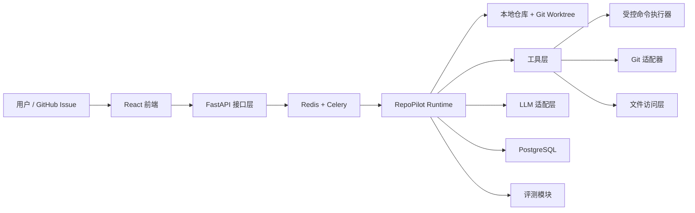

# RepoPilot 详细设计文档

## 1. 项目概述

RepoPilot 是一个面向小型到中型 Python / React 仓库的受控式代码修复 Agent。系统接收 GitHub Issue 或自然语言开发任务后，自动分析代码仓库、规划修复步骤、在隔离的 Git worktree 中修改代码、运行测试、根据失败日志迭代修复，最终输出可审查的代码 Diff、测试结果和 PR 风格摘要。

这个项目的目标不是做一个“会聊天的写代码助手”，而是做一个具备工程约束的 Agent 系统。它需要同时满足：

- 可执行，而不仅是给建议
- 可控制，而不是无限制运行
- 可观测，而不是黑盒推理
- 可评测，而不是停留在单次 Demo

## 2. 项目目标

### 2.1 背景问题

在真实研发场景中，存在大量低到中复杂度但重复出现的任务：

- 修复单元测试失败
- 根据 Issue 修复小型 Bug
- 升级依赖并处理兼容问题
- 补充边界条件和测试断言

传统的一次性 LLM 生成方案在这类任务上通常存在几个问题：

- 缺少仓库上下文，容易改错文件
- 不会主动运行测试，无法验证修改是否有效
- 经常产生过大 Diff，难以审查
- 过程不可追踪，失败原因难以定位

### 2.2 项目目标

构建一个围绕“任务理解 - 工具执行 - 测试反馈 - 失败修复”闭环运行的代码修复 Agent，重点实现：

- 仓库级上下文感知
- 受控工具调用
- 基于测试反馈的修复循环
- 风险命令权限控制
- 评测驱动的效果迭代

### 2.3 非目标

在第一版中，RepoPilot 不尝试解决以下问题：

- 大规模重构任务
- 跨多个仓库的联动修改
- 自动合并代码到主分支
- 无限制 shell 执行
- 高复杂度架构设计类任务

## 3. 用户与使用场景

### 3.1 目标用户

- 希望做出高质量 AI Agent 项目的学生
- 内部研发工具平台工程师
- 需要提升重复修复任务效率的小型研发团队
- 关注 Agent Engineering 的面试官或评审者

### 3.2 典型使用流程

1. 用户选择本地仓库或输入 GitHub 仓库地址
2. 用户提交 Issue 文本或自然语言修复任务
3. 系统创建独立工作树并分析仓库结构
4. Agent 规划修复步骤并调用搜索、读文件、改代码、跑测试等工具
5. 如果测试失败，进入 Repair Loop 继续修复
6. 最终输出：
   - 可审查 Diff
   - 测试结果
   - 执行轨迹
   - 变更摘要
   - 风险说明

## 4. 核心需求

### 4.1 功能需求

- 支持自然语言任务和 GitHub Issue 输入
- 支持仓库结构分析和 repo profile 生成
- 支持每个任务独立的 Git worktree 隔离
- 支持 Plan-Act-Observe-Repair Agent Runtime
- 支持代码搜索、文件读取、补丁应用、测试执行、Diff 查看
- 支持命令风险分级与人工审批
- 支持执行过程、结果和指标持久化
- 支持在前端展示运行轨迹和评测结果
- 支持离线 benchmark 评测

### 4.2 质量需求

- 结果可复现
- 操作边界清晰
- 执行过程可审计
- 失败时能安全退出
- 能用数据指导系统优化

## 5. 总体架构



系统整体分为六个部分：

- 前端：任务发起、结果展示、审批交互
- 后端 API：任务创建、状态查询、审批回调
- Runtime：Agent 规划与执行核心
- Tool Layer：代码搜索、文件操作、测试执行等工具
- Infra：数据库、缓存、队列、工作树管理
- Evaluation：离线评测、指标统计、失败回放

## 6. 模块设计

### 6.1 前端模块

前端职责：

- 创建新的 Agent Run
- 展示运行状态和步骤时间线
- 查看命令日志、测试输出和最终 Diff
- 处理高风险命令审批
- 展示 benchmark 对比结果和指标图表

推荐页面：

- `/runs`：任务列表
- `/runs/:id`：单次运行详情
- `/eval`：评测结果页
- `/repos`：仓库管理页

### 6.2 API 层

后端接口层职责：

- 校验任务输入
- 创建运行记录
- 投递后台执行任务
- 返回运行状态、Trace 和结果
- 接收人工审批动作

建议接口：

- `POST /api/runs`
- `GET /api/runs`
- `GET /api/runs/{id}`
- `POST /api/runs/{id}/approve`
- `POST /api/evals`
- `GET /api/evals/{id}`

### 6.3 Runtime Orchestrator

这是整个系统的核心。

职责包括：

- 构建任务上下文
- 调用 Planner 生成结构化计划
- 按计划执行工具
- 记录中间状态和 Trace
- 判断命令风险并触发审批
- 在失败时进入 Repair Loop

核心运行循环：

1. Plan：规划
2. Act：执行
3. Observe：观察结果
4. Repair / Finish：修复或结束

### 6.4 仓库管理模块

职责包括：

- 克隆或打开目标仓库
- 基于指定分支或 commit 创建独立 worktree
- 为每次任务分配单独工作目录
- 在失败时只回滚当前任务 worktree
- 收集最终 git diff 作为输出

采用 worktree 隔离的原因：

- 避免不同任务之间相互污染
- 保证运行过程可复现
- 便于回滚与清理

### 6.5 工具层

RepoPilot 不应依赖自由 shell，而应优先使用受控、结构化工具。

第一版建议提供以下工具：

- `repo_profile`
- `search_code`
- `read_file`
- `apply_patch`
- `list_tests`
- `run_tests`
- `run_lint`
- `git_diff`
- `summarize_failure`

每次工具调用都需要记录：

- 调用时间
- 输入参数
- 输出摘要
- 执行耗时
- 退出码
- 是否经过审批

### 6.6 命令风险控制模块

这是项目最能体现技术深度的部分之一。

#### 风险等级

- `safe_read`：只读命令，如 `rg`、`git status`、文件读取
- `safe_exec`：安全执行命令，如 `pytest`、`npm test`、`tsc --noEmit`
- `guarded_write`：受控写操作，如 patch 应用、lockfile 修改
- `high_risk`：高风险命令，如安装依赖、网络访问
- `blocked`：禁止命令，如破坏性删除、无边界 shell 操作

#### 控制策略

- 只读命令自动执行
- 受控写操作允许在 worktree 内执行并完整记录
- 高风险命令必须人工审批
- 禁止命令在 v1 中直接拦截

这里有一个很适合在面试中展开的 trade-off：

- 给 Agent 更多自由，任务成功率可能更高
- 给 Agent 更严格的约束，系统更安全、更可信

RepoPilot 的第一版会明确倾向后者。

### 6.7 LLM 适配层

职责包括：

- 统一不同模型服务商的调用方式
- 支持按任务类型切换模型和参数
- 记录 prompt、tokens、耗时和错误信息
- 支持失败重试和回退模型

建议按角色拆分 Prompt：

- Planner：任务规划
- File Selector：相关文件定位
- Patch Generator：代码修改生成
- Failure Analyzer：失败原因分析
- PR Summarizer：结果摘要生成

### 6.8 评测模块

一个没有评测的代码 Agent 很容易沦为 Demo，因此评测必须是系统级能力而不是附属功能。

职责包括：

- 加载 benchmark case
- 运行 RepoPilot 与 baseline
- 记录统一格式的结果
- 生成按任务类型、版本、策略维度的效果报告

## 7. 详细执行流程

### 7.1 输入阶段

输入信息包括：

- 仓库路径或 GitHub 地址
- 任务描述
- 基线分支或 commit
- 可选的测试命令覆盖

输出：

- 一条新的运行记录
- 后台执行任务

### 7.2 仓库画像阶段

系统首先生成 repo profile，包括：

- 顶层目录结构
- 使用的包管理器
- 测试框架
- 构建方式
- 主语言类型
- 可能的源码目录和测试目录

这个阶段的目标是减少上下文噪声，让后续 LLM 只关注真正相关的部分。

### 7.3 规划阶段

Planner 的输出必须是结构化 JSON，而不是纯文本描述。

示例：

```json
{
  "task_type": "bugfix",
  "suspected_files": ["src/foo.py", "tests/test_foo.py"],
  "test_strategy": ["pytest tests/test_foo.py -q"],
  "reasoning_summary": "Likely boundary issue in foo() implementation."
}
```

结构化规划的好处：

- 便于后续程序消费
- 便于评测规划质量
- 便于和执行日志对齐

### 7.4 执行阶段

执行阶段按顺序进行：

- 搜索相关符号、报错字符串、文件名
- 读取候选文件
- 生成或更新补丁
- 应用补丁
- 运行测试或静态检查

执行结果统一转成结构化事件写入 Trace。

### 7.5 观察阶段

观察结果包括：

- 测试通过 / 失败
- 失败日志摘要
- lint / type 错误
- 当前 Diff 大小
- 当前修改文件数

这些信息既服务于 Repair Loop，也服务于后续评测。

### 7.6 修复阶段

如果测试失败，系统进入 Repair Loop。

Repair Loop 的输入包括：

- 当前 Diff
- 失败命令
- 报错堆栈
- 上一轮计划
- 已修改文件列表

停止条件：

- 测试通过
- 达到最大迭代次数
- 需要执行高风险命令但未获批准
- 修改文件数超过阈值
- Diff 规模超过阈值

### 7.7 结束阶段

最终输出包括：

- 最终 Diff
- 运行是否成功
- 修改了哪些文件
- 执行过哪些命令
- PR 风格摘要
- 风险和残留问题说明

## 8. 数据模型设计

### 8.1 主要表结构

#### `repositories`

- `id`
- `name`
- `remote_url`
- `default_branch`
- `language_hint`
- `created_at`

#### `agent_runs`

- `id`
- `repository_id`
- `task_input`
- `task_type`
- `status`
- `base_ref`
- `worktree_path`
- `model_name`
- `started_at`
- `finished_at`

#### `run_steps`

- `id`
- `run_id`
- `step_index`
- `phase`
- `tool_name`
- `input_json`
- `output_json`
- `duration_ms`
- `status`

#### `command_events`

- `id`
- `run_id`
- `command`
- `risk_level`
- `approval_status`
- `exit_code`
- `stdout_summary`
- `stderr_summary`
- `duration_ms`

#### `evaluation_cases`

- `id`
- `repository_ref`
- `task_description`
- `base_ref`
- `test_command`
- `expected_signal`
- `difficulty`

#### `evaluation_runs`

- `id`
- `case_id`
- `agent_version`
- `success`
- `pass_rate`
- `token_cost`
- `wall_time_ms`
- `failure_reason`

## 9. API 设计草图

### 9.1 创建运行

`POST /api/runs`

```json
{
  "repository_id": "repo_123",
  "task_input": "Fix failing boundary check in parser and update tests.",
  "base_ref": "main"
}
```

### 9.2 查询运行详情

`GET /api/runs/{id}`

返回内容包括：

- 运行元数据
- 当前状态
- 步骤时间线
- 命令日志
- 修改文件
- Diff 摘要
- 最终结果

### 9.3 审批高风险命令

`POST /api/runs/{id}/approve`

```json
{
  "command_event_id": "cmd_456",
  "approved": true
}
```

## 10. 评测方案

### 10.1 为什么评测是核心能力

如果只展示一两个成功案例，项目很容易被认为是“偶然跑通的 Demo”。真正有说服力的 Agent 系统，必须能够回答：

- 成功率是多少
- 为什么失败
- 哪些优化真的有用
- 成本和收益之间的 trade-off 是什么

### 10.2 Benchmark 构成

第一版 benchmark 建议包含 30 到 50 个任务，覆盖：

- Python Bug 修复
- Python 测试修复
- React 类型错误修复
- React lint 修复
- 依赖升级兼容问题

每个 case 定义：

- 仓库快照
- 任务描述
- 成功判定命令
- 超时限制
- 允许命令范围

### 10.3 核心指标

主指标：

- 任务成功率
- 测试通过率
- 平均修复轮数
- 平均修改文件数
- 平均 Patch 大小
- 人工审批率
- 单任务 token 成本
- 总耗时

质量指标：

- 无关文件修改率
- 高风险命令请求率
- 全量测试回归率

### 10.4 对比 Baseline

建议与以下方案对比：

- single-shot patch 生成
- 只有规划和改单轮执行，没有 Repair Loop
- 有 Repair Loop 但没有权限控制

这样就能更好地展示系统设计的收益与代价。

## 11. 关键设计取舍

### 11.1 大上下文 vs 小上下文

- 大上下文召回更强，但成本高、干扰多
- 小上下文成本低，但容易漏掉关键文件

第一版决策：

- 用仓库画像 + 搜索召回 + 文件数上限的折中方案

### 11.2 自由 Shell vs 结构化工具

- 自由 Shell 灵活，但风险高且不可控
- 结构化工具安全，但扩展较慢

第一版决策：

- 优先结构化工具，只保留有限 shell 能力

### 11.3 完全自治 vs 人工审批

- 完全自治更容易展示“聪明”
- 审批机制更符合真实工程约束

第一版决策：

- 对高风险命令保留人工审批

### 11.4 多轮修复 vs 成本控制

- 更长的 Repair Loop 可能提高成功率
- 过多迭代会带来更高成本和漂移风险

第一版决策：

- 限制最大修复轮数，并统计边际收益

## 12. MVP 范围

第一版故意收窄范围，只解决最关键的问题。

### 12.1 包含内容

- 本地仓库输入
- Python 仓库优先
- Git worktree 隔离
- 搜索 / 读文件 / 应用补丁 / 跑 pytest / 看 diff
- 基础 Repair Loop
- Trace 存储和运行详情页
- 20 到 30 个 benchmark case

### 12.2 暂不包含

- 自动创建 GitHub PR
- 多仓库联动
- 浏览器工具
- 默认安装依赖
- 自动合并代码

## 13. 里程碑计划

### Milestone 1：Runtime 骨架

- 完成运行状态机
- 完成仓库管理模块
- 完成 Trace 存储结构

### Milestone 2：基础工具层

- 搜索、读文件、补丁、测试、Diff
- 命令风险分类器
- worktree 生命周期管理

### Milestone 3：第一个可运行 Agent

- 完成 Planner Prompt
- 完成补丁生成
- 完成 Repair Loop
- 完成结果摘要输出

### Milestone 4：前端可视化

- 任务列表页
- 运行详情页
- 时间线和命令日志
- Diff 概览

### Milestone 5：评测闭环

- benchmark schema
- 离线评测执行器
- 指标统计和结果对比页

## 14. 风险与应对

### 风险 1：Agent 改动了不相关文件

应对：

- 限制最大修改文件数
- 限制 Diff 大小
- 在评测中统计无关文件修改率

### 风险 2：Repair Loop 陷入重复失败

应对：

- 限制最大迭代次数
- 识别重复错误并提前终止
- 对连续失败模式做摘要归类

### 风险 3：测试太慢或不稳定

应对：

- 先跑定向测试
- case 级别设置超时
- 在 benchmark 中标记 flaky case

### 风险 4：权限控制过严导致成功率下降

应对：

- 提供高风险命令审批入口
- 统计被拦截命令对成功率的影响

## 15. Demo 方案

推荐的展示顺序：

1. 选择一个仓库和一个 Bug 修复任务
2. 展示 repo profile 和结构化 plan
3. 展示工具调用和首次测试失败
4. 展示 Repair Loop 第二次修改
5. 展示测试通过和最终 Diff
6. 展示该任务在 benchmark 中的历史表现

这套展示比“Agent 帮我改了一段代码”更能体现系统设计和工程深度。

## 16. 简历与面试价值

这个项目适合放在简历第一项目，原因在于它同时体现了：

- AI Native 项目审美
- Agent 运行时设计能力
- 受控执行和权限边界意识
- 评测驱动迭代思维
- 工程化和产品化结合能力

一句简历描述可以写成：

> 设计并实现受控式代码修复 Agent，将自然语言任务转化为可执行的 patch-test-repair 工作流，结合 Git worktree 隔离、命令权限控制和 benchmark 评测，提升代码修改的可验证性与可审计性。

## 17. 下一步实现建议

建议先做一个 Python-only 的最小可运行版本：

- 本地仓库输入
- 文本任务输入
- worktree 隔离
- `rg` 搜索 + 文件读取 + 补丁生成 + `pytest`
- 一轮 Repair Loop
- Trace 页面

如果这个链路跑通，再逐步扩展到：

- React / TypeScript 仓库
- 更丰富的审批交互
- 自动 benchmark 执行
- 更多类型的修复任务
